# Dane Parin

Indie dev. Two CLI tools I currently maintain, both open source.

---

**[standup-bot](https://github.com/SemTiOne/standup-bot)** — turns git history into a daily standup, using a local LLM (Ollama) or a free cloud one (Groq) if you'd rather not run a model locally.

`Python 3.10–3.13` · `SQLite, WAL mode` · `Rich`

v0.2.3 shipped with a real bug: `options={"timeout": 60}` was passed as a model parameter instead of an HTTP timeout, so Ollama silently ignored it and requests could hang indefinitely. Found it, fixed it by moving the timeout into `ollama.Client(...)`, and wrote a regression test so it can't come back quietly. It's in the changelog under v0.2.3, dated the day it was fixed.

- CI runs ruff, mypy, bandit, and pip-audit before any test executes
- Four Python versions (3.10–3.13), sixteen test modules
- All SQL parameterized
- All output paths (logs and terminal) pass through redaction, including type-tagged detection for GitHub tokens, LLM API keys, AWS keys, Slack tokens, and credentialed URIs

**[env-auditor](https://github.com/SemTiOne/env-auditor)** — diffs the env vars your code actually references against your `.env.example`, across six languages. Catches undocumented, stale, and missing-default variables.

`Python 3.10+` · zero runtime dependencies

It scans source trees it doesn't control, so it's written defensively on purpose. Lines over 2000 characters are skipped to avoid ReDoS, symlinks are never followed, and `--exclude` paths that try to escape the scan root are rejected outright.

- 141 tests, 85% coverage floor enforced in CI
- Matrix-tested across three operating systems and three Python versions
- `mypy --strict` is a hard CI gate, zero errors

---

**Open source contributions** — three fixes merged into [Termstory](https://github.com/bitflicker64/Termstory) on three consecutive days (Jun 29 – Jul 1, 2026), each closing a tracked issue in a different subsystem: circuit breaker limits ([#179](https://github.com/bitflicker64/Termstory/pull/179), closes #118), clustering threshold ([#186](https://github.com/bitflicker64/Termstory/pull/186), closes #119), and SQLite connection timeout ([#187](https://github.com/bitflicker64/Termstory/pull/187), closes #123). The circuit breaker fix went through five rounds of automated review before merge, catching a race condition in the config cache and a silent-mutation trap in the backward-compatibility shim along the way. A fourth fix followed a few days later, narrowing three bare-except blocks that were silently swallowing errors during snapshot capture ([#231](https://github.com/bitflicker64/Termstory/pull/231)).

Root-caused four separate bugs behind [AynOps](https://github.com/AynOps/AynOps)' header analyzer producing different results than browser DevTools ([#68](https://github.com/AynOps/AynOps/pull/68)) — a duplicate-header collapse, Cloudflare's bot-challenge page being silently analyzed as if it were the real site, an invisible redirect chain, and three scoring-logic bugs — confirmed against a live production site, with a maintainer-flagged edge case fixed before merge. Also fixed an inverted security-policy condition in [composable-data-stack](https://github.com/RonaldHensbergen/composable-data-stack/pull/156) that was silently passing risky untagged container images instead of flagging them, and added ruff linting to CI, along with fixing the violations it caught in [thumper](https://github.com/jestasecurity/thumper/pull/177). More merged PRs across other repositories: [full list](https://github.com/pulls?q=is%3Apr+is%3Amerged+author%3ASemTiOne+archived%3Afalse).

---

**Stats**

---

[X / Twitter](https://twitter.com/DParin28178) — build-in-public updates.
