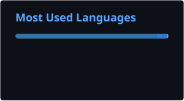

# Dane Parin

Backend & DevOps Engineer. I build CLI tools, databases, automations, and containerized applications using Python, Java, C++, Docker, CI/CD, and MySQL. Three CLI tools I currently maintain, all open source.

---

**[standup-bot](https://github.com/SemTiOne/standup-bot)** — turns git history into a daily standup using a local LLM (Ollama) or a free cloud one (Groq).

`Python` · `SQLite, WAL mode` · `Rich`

v0.2.3 had a real bug: a timeout was passed as a model parameter instead of an HTTP timeout, so Ollama silently ignored it and requests could hang forever. Fixed by moving it into `ollama.Client(...)`, with a regression test so it stays fixed. CI gates on ruff, mypy, bandit, and pip-audit before tests run; all SQL is parameterized, and secrets like tokens and API keys are redacted from every log and terminal output.

**[env-auditor](https://github.com/SemTiOne/env-auditor)** — diffs the env vars your code actually references against `.env.example`, across six languages, catching what's undocumented, stale, or missing a default.

`Python` · zero runtime dependencies

Written defensively since it scans code it doesn't control: long lines are skipped to avoid ReDoS, symlinks are never followed, and `--exclude` paths can't escape the scan root. 141 tests, 85% coverage enforced in CI, tested across three OSes and three Python versions, with `mypy --strict` as a hard gate.

**[chess-review-bot](https://github.com/SemTiOne/chess-review-bot)** — reviews a PR's diff and labels each file with chess Game Review vocabulary (Brilliant, Blunder...), using a deterministic rule table instead of an LLM call, reasoning documented in an ADR.

`Python` · GitHub Action + PyPI CLI

Shipped broken: the Action doubled its own path and failed every run with exit code 2 before classifying anything, caught immediately by dogfooding it on this repo's own PRs and fixed in v0.1.1. Published to PyPI via OIDC, no stored token; secrets are stripped from every subprocess call before it touches git.

Also built [position-evaluator](https://github.com/SemTiOne/position-evaluator) for a weekend hackathon — a MySQL-backed Flask app using Gemini structured output, where the lessons on getting reliable output out of an LLM led directly to chess-review-bot's classifier above being deterministic instead.

---

**Open source contributions** — merged three fixes into [Termstory](https://github.com/bitflicker64/Termstory) on three consecutive days, each in a different subsystem. The circuit breaker fix alone went through five rounds of review, catching a race condition and a silent mutation trap in a backward-compat shim along the way. Two more fixes followed over the next two weeks.

Root-caused four separate bugs behind [AynOps](https://github.com/AynOps/AynOps)' header analyzer disagreeing with browser DevTools, confirmed against a live production site.

Hardened [composable-data-stack](https://github.com/RonaldHensbergen/composable-data-stack)'s Docker image; pinned to a digest, moved off root; validated by actually building and running it, and separately closed a `.env` leak into the build context.

Fixed a session-hijack path in [thumper](https://github.com/jestasecurity/thumper) and added its ruff linting. Three merged fixes to [odys](https://github.com/ramirocrc/odys), an energy-optimization model, including one where the linked issue's own suggested fix was mathematically wrong. More merged PRs: [full list](https://github.com/pulls?q=is%3Apr+is%3Amerged+author%3ASemTiOne+archived%3Afalse).

---

**Stats**

---

[X / Twitter](https://twitter.com/DParin28178) — build-in-public updates.
